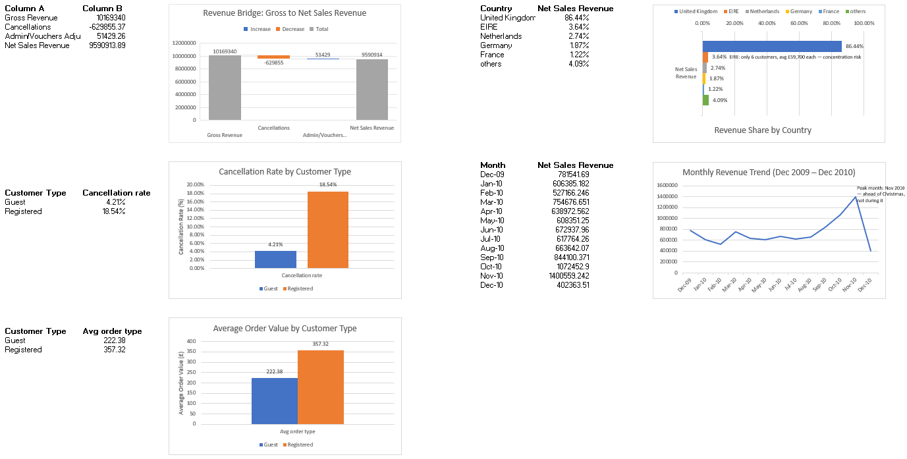

# Online Retail Sales Analysis

Analyzed £9.6M in UK online retail transactions to uncover revenue leakage, customer concentration risk, and seasonal demand patterns.

## Business Problem

This project analyzes transaction data from an online gift/houseware retailer, where three business functions have a stake in the results: Finance cares about the Revenue Bridge (where money leaks — cancellations, write-offs, vouchers); Customer Service cares about the cancellation rate by customer type (18.54% Registered vs. 4.21% Guest — a pattern worth investigating); and Operations cares about cancelled order volume (4,592 of 28,816 orders) — wasted picking/packing time and labor on orders that never shipped. I analyzed the transaction-level data to surface these findings for each stakeholder.

## Key Findings

- **Revenue Bridge:** Net Sales Revenue — after excluding cancellations, write-offs, and vouchers — totals £9,590,901.39.
- **EIRE Concentration Risk:** Just 6 customer accounts generate £348,868.92 (3.64%) of Net Sales Revenue, averaging £58,144.82 per account — versus £2,057 per account in the UK.
- **Cancellation Rate:** Registered customers cancel orders at 18.54%, nearly 4.4x higher than Guest customers at 4.21%.
- **Seasonal Pattern:** November (£1.40M) is the peak revenue month — not December (£402K) — meaning restocking needs to happen before November, not for a Christmas rush.

Full write-up with confirmed vs. not-confirmed reasoning and business impact/benefit/risk analysis: see [`docs/EDA_Findings.md`](docs/EDA_Findings.md).

## Dashboard

## Tools Used

Excel, Power Query, Power Pivot (DAX)

## Data Source

[Online Retail II — UCI Machine Learning Repository](https://archive.ics.uci.edu/dataset/502/online+retail+ii)
Transaction data (Dec 2009 – Dec 2010 sheet used) from a UK-based online gift/houseware wholesaler. Raw dataset not included in this repo — see link above to access it directly.

## Project Documentation

- [Executive Summary](docs/Executive_Summary.md)
- [Full EDA Findings](docs/EDA_Findings.md)
- [Data Dictionary](docs/Data_Dictionary.md)
